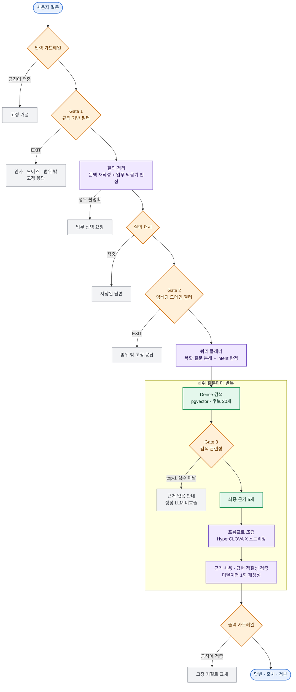
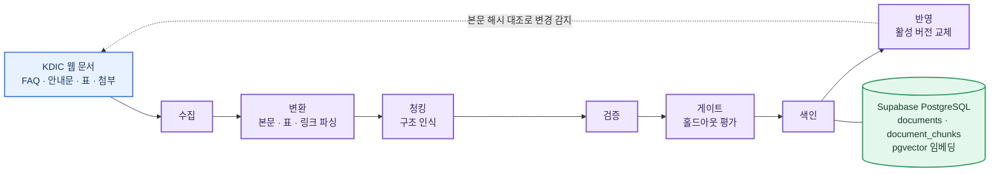

# KDIC RAG Workflow

예금보험공사(KDIC) 공식 웹 지식에 근거해 답변·출처·신청 정보를 제공하는 RAG 챗봇과, 그 지식·설정을 개발자 없이 운영하기 위한 관리자 콘솔입니다.

KDIC 웹사이트의 FAQ·안내문·표·첨부파일을 구조를 살려 색인하고, 답변이 실제로 근거를 썼는지 생성이 끝난 뒤 별도로 검증합니다. 운영자는 지식 데이터·재색인·RAG 파라미터·프롬프트·평가·대화 로그를 화면에서 관리합니다.

## 설계 원칙

이 세 가지가 아래 파이프라인의 모양을 결정합니다.

- **LLM에 닿기 전에 싸게 거른다** — 답할 수 없는 질문은 규칙 → 임베딩 → 검색 관련성 순으로, 비용이 낮은 판정부터 차례로 막습니다. 마지막 관문까지 가도 생성 모델은 호출하지 않습니다.
- **출처는 LLM에게 맡기지 않는다** — 답변 본문만 생성 모델이 쓰고, 실제 페이지·서류·신청 링크는 색인 데이터에서 코드가 결정론적으로 붙입니다. 본문에 남은 URL은 응답 직전에 제거합니다.
- **생성과 판정을 분리한다** — "근거를 썼는가"를 생성 모델의 자기보고로 묻지 않고, 스트리밍이 끝난 뒤 별도 호출로 판정합니다.

## 답변 파이프라인

> 보라색은 LLM 호출이 있는 단계, 초록색은 검색, 주황색은 판정입니다. 종료 분기(회색)는 그 자리에서 응답이 확정되며, 모두 같은 SSE `done` 이벤트 하나로 나갑니다. 후보 수·근거 수와 각 임계값은 문서화된 기본값이고, 운영자가 관리자 콘솔에서 바꿀 수 있습니다.

### 답하기 전에 멈추는 지점

관문이 여러 겹인 이유는 각 단계의 비용이 다르기 때문입니다. 위로 갈수록 싸게 막습니다.

| 멈추는 지점 | 조건 | 사용자에게 나가는 것 | 그때까지 쓴 LLM 호출 |
|---|---|---|---|
| 입력 가드레일 | 운영자가 게시한 금칙어가 질문에 있음 | 고정 거절 문구 | 0 |
| Gate 1 · 규칙 | 인사·감사·노이즈·정체성 질문, 보안 우회, 개인정보 직접 조회, 명백한 타 분야 | 고정 응답 | 0 |
| 업무 되묻기 | 어느 업무에 대한 질문인지 특정되지 않음 | 업무 선택 버튼 | 1 |
| 질의 캐시 | 같은 질문이 24시간 안에 정상 처리됨 | 저장된 답변 그대로 | 1 |
| Gate 2 · 임베딩 | 범위 밖 참조문과의 유사도가 임계값 이상이고 범위 안보다 높음 | 고정 응답 (Gate 1과 같은 문구) | 1 |
| Gate 3 · 검색 관련성 | 검색 후보의 top-1 점수가 임계값 미달이거나 후보 없음 | 근거 없음 안내 | 2 · **생성 모델은 호출하지 않음** |
| 출력 가드레일 | 금칙어가 생성된 답변에 있음 | 확정 응답을 고정 거절로 교체 | 전 단계 그대로 |

Gate 1과 Gate 2는 **정밀도 우선**입니다. 범위 밖을 많이 잡는 것이 아니라 정상 질문을 잘못 막지 않는 것이 목표라, 조금이라도 애매하면 통과시킵니다. Gate 2가 어떤 범주(일상 잡담·인접 도메인·개인정보 상담·프롬프트 인젝션)로 판정했는지는 응답에 절대 노출하지 않고 내부 관측에만 남깁니다.

### 질문을 정리하는 방식

대화 이력을 생성 모델에 그대로 누적하지 않고, 검색 **전에** 질문 하나로 정리합니다.

| 들어온 질문 | 처리 |
|---|---|
| `착오송금 반환지원이 뭐야?` → `신청 기한은?` | 이전 대상을 채워 독립 질문으로 재작성 |
| `신청 링크 알려줘` | 대상 업무가 없어 업무 선택을 요청 |
| `예금자보호 한도는 얼마인가요?` | 자립적인 질문이라 원문 그대로 검색 |

이 판정은 게이트·캐시보다 **앞**에 있습니다. 뒤에 두면 `그거는요?` 같은 파편 문장이 도메인 필터에 걸려 멀티턴이 끊기고, 캐시 키도 파편 문장이라 적중하지 않습니다.

> 대화 전체를 기억해 추론하는 에이전트가 아니라 **후속 질문의 문맥을 해소하는 검색 전처리**입니다. 이력은 재작성과 되묻기 판정에만 쓰이고, 답변 생성 프롬프트에는 들어가지 않습니다.

## 데이터 · 색인 파이프라인

이 7단계는 관리자 화면의 진행바와 같은 이름이고, 재수집·재색인 잡이 실제로 이 순서대로 실행됩니다.

- **구조 인식 청킹** — FAQ는 질문·답변 쌍 단위로, 표는 블록마다 자기 헤더를 반복해 self-describing하게, 그 외 문서는 페이지 단위로 나눕니다. 모든 청크 앞에는 `[페이지 제목 · 업무]` 프리픽스가 붙습니다. 본문에 주제어가 없는 짧은 청크가 검색에 걸리지 않던 문제를 해결한 결정론적 contextual retrieval입니다.
- **변경 감지** — 원문이 바뀌었는지는 HTML이 아니라 **본문 텍스트 해시**로 판정합니다. HTML은 판본·세션 토큰 탓에 튑니다. 감지는 표시만 하고, 실제 반영은 운영자가 재수집을 실행할 때 이뤄집니다.
- **색인 게이트** — 새 청크로 메모리 인덱스를 만들어 홀드아웃 문항을 검색해 봅니다. 현재 정책은 **차단이 아니라 경고 기록**이며, 미달이어도 색인은 진행하고 판정 결과가 잡 기록에 남습니다. 롤백 잡은 직전에 통과한 스냅샷으로 되돌리는 것이라 게이트를 건너뜁니다.
- **버전·롤백** — 색인 교체는 입력 스냅샷 단위로 기록되어 직전 상태로 되돌릴 수 있고, 색인이 바뀌면 질의 캐시가 자동 무효화됩니다.

운영 Dense 검색은 Supabase의 pgvector 한 곳을 봅니다. BM25는 별도 저장소가 아니라 서비스 프로세스가 코퍼스에서 메모리로 구성하는 인덱스이며, 평가와 선택적 Hybrid 경로에서만 쓰입니다. 활성 색인 버전이 교체되면 이 메모리 인덱스도 다시 조립되어 두 축이 같은 청크를 보게 합니다.

## 평가 · 운영

파라미터·프롬프트·금칙어는 모두 **초안 → 평가 → 게시 → 롤백** 흐름을 거칩니다. 운영에 바로 반영되는 값은 없습니다.

**측정 지표**

| 축 | 지표 |
|---|---|
| 검색 | Recall@1/3/5/10/20, MRR, ContextHit(생성 모델이 실제로 받은 근거에 정답이 있는 비율) |
| 생성 | 핵심 정보 포함률, 출처 정확률, 범위 밖 거절률, 생성 성공률 |
| 운영 | 응답 시간, 오류 코드별 실패, 사용자 피드백, Langfuse trace |
| 강건성 | 오타 질문과 원본 질문의 Recall@5 비교 |

**반영 게이트 기준** — 검색 정확도@5 0.92 이상 · MRR 0.80 이상 · 생성 성공률 99.5% 이상 · 평균 응답시간 10초 이하. 이 값은 서버가 정본으로 갖고 있어 화면에서 낮출 수 없습니다.

평가는 튜닝에 쓰지 않은 held-out 세트로 합니다. 방식 선택에 쓴 데이터로 성능을 재면 부풀려지기 때문에, 개발용 세트와 최종 확인용 세트를 분리해 둡니다.

## 관리자 콘솔

| 화면 | 하는 일 |
|---|---|
| 대시보드 | 운영 요약 지표 |
| 지식 데이터 | 페이지·청크 조회. 추가·수정·삭제·검색 제외는 승인 요청을 거쳐 반영되며, 신규 페이지는 미리보기로 파싱·청킹을 검수한 뒤 적재 |
| 데이터 파이프라인 | 재수집·재색인 잡 실행과 7단계 진행 상황, 변경 감지, 롤백 |
| 대화 로그 | 실사용 질의 1건 단위 조회 — 근거 수·근거 사용 여부·검증 판정·오류 코드·trace 링크 |
| 평가 | 평가셋 편집·반영, 평가 실행, 게이트 판정 |
| RAG 파라미터 | 후보 수·최종 근거 수·리랭커 등 초안 편집, A/B 검색 비교, 게시·이력·롤백 |
| 프롬프트·가드레일 | 프롬프트와 금칙어 초안, 전후 비교 평가, 게시·롤백 |
| 운영 정책 / 권한 / 활동 로그 | 캐시 정책, 계정 권한, 변경 이력 |

## 기술 스택

| 영역 | 기술 |
|---|---|
| Frontend | React 19 · TypeScript · Vite |
| Backend | FastAPI · Server-Sent Events |
| 데이터 · 벡터 검색 | Supabase PostgreSQL + pgvector |
| 임베딩 | `dragonkue/BGE-m3-ko` (1024차원) |
| 질의 정리 · 플래닝 | OpenAI structured output (`gpt-5.6-luna`) |
| 답변 생성 | HyperCLOVA X (토큰 스트리밍) |
| 키워드 검색 | BM25 (kiwi 형태소) — 평가 · 선택적 Hybrid |
| 배치 실행 | 잡 테이블 폴링 워커 |
| 관측 | Langfuse trace · PostgreSQL 질의 로그 |

> 기본 검색 경로는 Dense 단일 경로입니다. 리랭커·질문 유형별 Hybrid 라우팅·업무 필터는 실측 결과에 따라 현재 모두 꺼져 있으며, 코드는 재도입에 대비해 남겨 두고 재측정 후 판단합니다.
