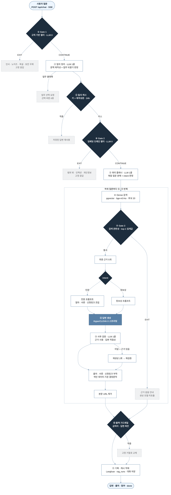
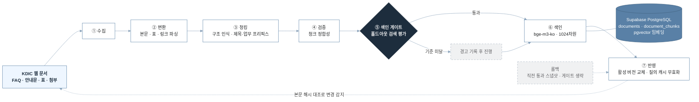
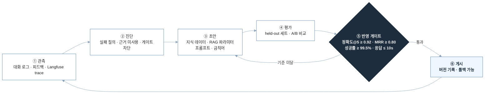

# KDIC RAG Workflow

**예금보험공사 공식 웹 지식 기반 RAG 챗봇 · 운영 콘솔**

근거 기반 답변 · 결정론적 출처 부착 · 생성/검증 분리

 

 

예금보험공사(KDIC) 공식 웹 지식에 근거해 답변·출처·신청 정보를 제공하는 RAG 챗봇과, 해당 지식·설정을 개발자 개입 없이 운영하기 위한 관리자 콘솔로 구성됩니다.

KDIC 웹사이트의 FAQ·안내문·표·첨부파일을 구조를 유지한 형태로 색인하고, 생성된 답변이 실제로 근거를 사용했는지를 생성 완료 후 별도로 검증합니다. 운영자는 지식 데이터·재색인·RAG 파라미터·프롬프트·평가·대화 로그를 관리자 화면에서 관리합니다.

<table>
<tr>
<td width="33%" valign="top">

**⬢ 단계적 필터링**

답변할 수 없는 질문은 규칙 → 임베딩 유사도 → 검색 관련성 순으로, 연산 비용이 낮은 단계부터 순차적으로 차단합니다. 마지막 판정 단계까지 도달하더라도 **생성 모델은 호출하지 않습니다.**

</td>
<td width="33%" valign="top">

**⬢ 출처는 앱이 결정**

생성 모델은 답변 본문만 작성하며, 실제 페이지·서류·신청 링크는 색인 데이터를 기준으로 애플리케이션이 **결정론적으로** 부착합니다. 본문에 포함된 URL은 응답 확정 직전에 제거합니다.

</td>
<td width="33%" valign="top">

**⬢ 생성과 검증의 분리**

근거 사용 여부를 생성 모델의 자기 보고에 의존하지 않고, 스트리밍 종료 후 **별도 호출로 검증**합니다.

</td>
</tr>
</table>

 

## 목차

| | | |
|---|---|---|
| [답변 파이프라인](#답변-파이프라인) | [조기 종료 지점](#조기-종료-지점) | [질의 전처리](#질의-전처리) |
| [데이터 · 색인 파이프라인](#데이터--색인-파이프라인) | [평가 · 운영](#평가--운영) | [관리자 콘솔](#관리자-콘솔) |
| [기술 스택](#기술-스택) | | |

 

## 답변 파이프라인

> [!NOTE]
> 마름모는 **판정 단계**, 「LLM 1콜」 표기는 해당 단계가 LLM을 호출함을 뜻합니다. 정상 경로의 LLM 호출은 **3회**(질의 정리 · 플래너 · 사후 검증)이며 생성 모델 호출은 별도입니다. 종료 분기는 해당 지점에서 응답이 확정되며, 모든 분기가 동일한 SSE `done` 이벤트로 전달되고 기록 단계를 거칩니다. 후보 수·근거 수 및 각 임계값은 문서화된 기본값이며, 관리자 콘솔에서 변경할 수 있습니다.

 

### 조기 종료 지점

판정 단계를 여러 겹으로 구성한 것은 각 단계의 연산 비용이 다르기 때문입니다. 표의 위쪽일수록 비용이 낮은 단계입니다.

| 종료 단계 | 조건 | 응답 내용 | 누적 LLM 호출 |
|---|---|---|:--:|
| **Gate 1 · 규칙** | 인사·감사·노이즈·정체성 질문, 순수 욕설·협박, 보안 우회, 개인정보 직접 조회, 명백한 타 분야 질문 | 고정 응답 | `0` |
| **업무 되묻기** | 대상 업무가 특정되지 않음 | 업무 선택 버튼 | `1` |
| **질의 캐시** | 동일 질문이 24시간 이내에 정상 처리된 이력이 있음 | 저장된 답변 | `1` |
| **Gate 2 · 임베딩** | 범위 밖 참조문과의 유사도가 임계값 이상이며 범위 내 유사도보다 높음 | 고정 응답 (Gate 1과 동일 문구) | `1` |
| **Gate 3 · 검색 관련성** | 검색 후보의 top-1 점수가 임계값 미달이거나 후보 없음 | 근거 없음 안내 | `2` **생성 모델 미호출** |
| **출력 가드레일** | 생성된 답변에 금칙어가 포함됨 | 확정 응답을 고정 거절로 교체 | 이전 단계와 동일 |

Gate 1과 Gate 2는 **정밀도 우선**으로 설계되어 있습니다. 범위 밖 질문의 검출률(recall)이 아니라 정상 질문의 오차단 방지(precision)를 목표로 하므로, 판정이 불확실한 경우에는 통과시킵니다. Gate 2가 어떤 범주(일상 잡담·인접 도메인·개인정보 상담·프롬프트 인젝션)로 판정했는지는 사용자 응답에 노출하지 않고 내부 관측 기록에만 남깁니다.

안전 관련 판정도 이 두 게이트가 담당합니다. 보안 우회 시도는 Gate 1의 전용 규칙이, 프롬프트 인젝션과 개인정보 조회·대리 요청은 Gate 2의 범위 밖 참조 클러스터가 판정합니다.

운영자가 관리하는 금칙어는 이와 별개의 키워드 계층으로, 규칙마다 질문·답변 중 어디에 적용할지 지정합니다. 다만 부분 일치 방식이라 정상 질문에 비속어가 덧붙은 경우까지 차단하는 문제가 있어, 질문 측 비속어 판정은 **메시지 전체가 해당 단어로만 구성된 경우에만** 차단하는 Gate 1 규칙으로 분리했습니다. 따라서 금칙어는 주로 생성된 답변을 검사하는 출력 가드레일에서 동작합니다.

 

### 질의 전처리

대화 이력을 생성 모델 입력에 누적하지 않고, 검색 이전에 단일 질의로 정리합니다.

| 입력 질문 | 처리 |
|---|---|
| `착오송금 반환지원이 뭐야?` → `신청 기한은?` | 이전 대상을 보완해 독립 질의로 재작성 |
| `신청 링크 알려줘` | 대상 업무가 없으므로 업무 선택을 요청 |
| `예금자보호 한도는 얼마인가요?` | 자립적인 질문이므로 원문 그대로 검색 |

이 처리는 게이트·캐시보다 앞 단계에 배치되어 있습니다. 이후 단계에 배치할 경우 `그거는요?`와 같은 불완전한 문장이 도메인 필터에서 차단되어 멀티턴 대화가 중단되며, 캐시 키 역시 불완전한 문장이 되어 적중하지 않습니다.

> [!TIP]
> 대화 전체를 컨텍스트로 유지하며 추론하는 에이전트가 아니라, **후속 질문의 문맥을 해소하는 검색 전처리**입니다. 대화 이력은 재작성과 되묻기 판정에만 사용되며, 답변 생성 프롬프트에는 포함되지 않습니다.

 

## 데이터 · 색인 파이프라인

이 7단계는 관리자 화면의 진행 표시와 동일한 명칭이며, 재수집·재색인 작업이 이 순서대로 실행됩니다.

<b>단계별 설계 근거</b>

 

- **구조 인식 청킹** — FAQ는 질문·답변 쌍 단위로, 표는 블록마다 해당 헤더를 반복해 self-describing한 형태로, 그 외 문서는 페이지 단위로 분할합니다. 모든 청크 앞에는 `[페이지 제목 · 업무]` 프리픽스를 부여합니다. 본문에 주제어가 포함되지 않은 짧은 청크가 검색되지 않던 문제를 해결하기 위한 결정론적 contextual retrieval 구현입니다.
- **변경 감지** — 원문 변경 여부는 HTML이 아니라 **본문 텍스트 해시**로 판정합니다. HTML은 판본·세션 토큰의 영향으로 변동이 발생하기 때문입니다. 감지 단계는 변경 사실을 표시할 뿐이며, 실제 반영은 운영자가 재수집을 실행할 때 이루어집니다.
- **색인 게이트** — 신규 청크로 메모리 인덱스를 구성해 홀드아웃 문항의 검색 성능을 측정합니다. 현재 정책은 **차단이 아니라 경고 기록**이며, 기준 미달인 경우에도 색인은 진행하고 판정 결과를 작업 기록에 남깁니다. 롤백 작업은 직전에 통과한 스냅샷으로 복원하는 것이므로 게이트를 건너뜁니다.
- **버전 관리·롤백** — 색인 교체는 입력 스냅샷 단위로 기록되어 직전 상태로 복원할 수 있으며, 색인이 변경되면 질의 캐시가 자동으로 무효화됩니다.

운영 환경의 Dense 검색은 Supabase pgvector 단일 저장소를 사용합니다. BM25는 별도 저장소가 아니라 서비스 프로세스가 코퍼스로부터 메모리에 구성하는 인덱스이며, 평가 및 선택적 Hybrid 경로에서만 사용됩니다. 활성 색인 버전이 교체되면 이 메모리 인덱스도 재구성되어 두 검색 축이 동일한 청크를 참조하도록 보장합니다.

 

## 평가 · 운영

파라미터·프롬프트·금칙어는 모두 **초안 → 평가 → 게시 → 롤백** 흐름을 거칩니다. 운영에 즉시 반영되는 값은 없습니다.

**측정 지표**

| 축 | 지표 |
|---|---|
| **검색** | Recall@1/3/5/10/20, MRR, ContextHit(생성 모델에 실제로 전달된 근거에 정답이 포함된 비율) |
| **생성** | 핵심 정보 포함률, 출처 정확률, 범위 밖 거절률, 생성 성공률 |
| **운영** | 응답 시간, 오류 코드별 실패, 사용자 피드백, Langfuse trace |
| **강건성** | 오타 질문과 원본 질문의 Recall@5 비교 |

**반영 게이트 기준**

<table>
<tr align="center">
<td width="25%">검색 정확도@5 <b>≥ 0.92</b></td>
<td width="25%">MRR <b>≥ 0.80</b></td>
<td width="25%">생성 성공률 <b>≥ 99.5%</b></td>
<td width="25%">평균 응답시간 <b>≤ 10s</b></td>
</tr>
</table>

이 기준값은 서버가 정본으로 관리하므로 관리자 화면에서 임의로 조정할 수 없습니다.

평가는 튜닝에 사용하지 않은 held-out 세트로 수행합니다. 방식 선택에 사용한 데이터로 성능을 측정하면 결과가 과대평가되므로, 개발용 세트와 최종 검증용 세트를 분리해 운용합니다.

 

## 관리자 콘솔

| 화면 | 기능 |
|---|---|
| **대시보드** | 운영 요약 지표 |
| **지식 데이터** | 페이지·청크 조회. 추가·수정·삭제·검색 제외는 승인 요청을 거쳐 반영되며, 신규 페이지는 미리보기로 파싱·청킹 결과를 검수한 후 적재 |
| **데이터 파이프라인** | 재수집·재색인 작업 실행 및 7단계 진행 상황, 변경 감지, 롤백 |
| **대화 로그** | 실사용 질의 단위 조회 — 근거 수, 근거 사용 여부, 검증 판정, 오류 코드, trace 링크 |
| **평가** | 평가셋 편집·반영, 평가 실행, 게이트 판정 |
| **RAG 파라미터** | 후보 수·최종 근거 수·리랭커 등 초안 편집, A/B 검색 비교, 게시·이력·롤백 |
| **프롬프트·가드레일** | 프롬프트 및 금칙어 초안, 전후 비교 평가, 게시·롤백 |
| **운영 정책 / 권한 / 활동 로그** | 캐시 정책, 계정 권한, 변경 이력 |

 

## 기술 스택

| 영역 | 기술 |
|---|---|
| **Frontend** | React 19 · TypeScript · Vite |
| **Backend** | FastAPI · Server-Sent Events |
| **데이터 · 벡터 검색** | Supabase PostgreSQL + pgvector |
| **임베딩** | `dragonkue/BGE-m3-ko` (1024차원) |
| **질의 정리 · 플래닝** | OpenAI structured output (`gpt-5.6-luna`) |
| **답변 생성** | HyperCLOVA X (토큰 스트리밍) |
| **키워드 검색** | BM25 (kiwi 형태소) — 평가 · 선택적 Hybrid |
| **배치 실행** | 작업 테이블 폴링 워커 |
| **관측** | Langfuse trace · PostgreSQL 질의 로그 |

> [!IMPORTANT]
> 기본 검색 경로는 **Dense 단일 경로**입니다. 리랭커, 질문 유형별 Hybrid 라우팅, 업무 필터는 실측 결과에 따라 현재 모두 비활성 상태이며, 관련 코드는 재도입에 대비해 유지하고 있습니다. 도입 여부는 재측정 결과를 근거로 판단합니다.
